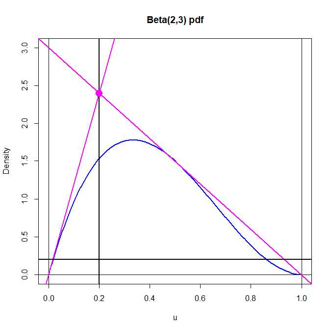

---
output:
  pdf_document: default
  html_document: default
---
# Simulation 03

##### 2018-10-10  Josep Fortiana

## Basic acceptance-rejection algorithm

A straightforward implementation of the basic acceptance-rejection algorithm. 
Code for generating a sequence of random numbers following a given probability distribution, with parameters:
- `n` is the sequence length,
- `f` is the target pdf, 
- `g` is the candidate pdf, 
- `rg` is a function that generates random numbers following `g`. 
- `c` is the constant such that `f(x)<=c * g(x)` for all `x`.

The function returns a list with `z`, the sequence of random numbers, and `Proportion` of accepted values.

```{r}
Accept.Reject<-function(f,g,rg,c,n=1.0e4){
    z<-rep(0,n) 
    N<-0
    for (i in 1:n){
        accept<-FALSE
        while (accept == FALSE){
            u <- runif(1)
            v <- rg(1)
            N<-N+1
            if (c*u <= f(v)/g(v)){
                z[i] <- v
                accept <- TRUE
                }
            }
        }
    Proportion<-n/N
    return(list(z=z,Proportion=Proportion))
    }
```

### Exercise 1

Generate a sequence of random numbers following a $\mbox{Beta}(2,2)$ using a $\mbox{Unif}(0,1)$ candidate pdf.

The target pdf `f(x)`is:

$$
    f(x)=6\,x\,(1-x)=6\,(x-x^{2}), \quad x\in(0,1).
$$

The candidate $\mbox{Unif}(0,1)$ pdf is:

$$
    g(x)=1, \quad x\in(0,1).
$$

The steps are:

   1. Calculate `c` such that `f(x)<=c * g(x)`,  _[Hint: plot both `f(x)`and `g(x)`],_
   2. Use the `Accept.Reject` function above (or some improvement thereof) for several `n` values,
   3. Plot histograms of the resulting sequences, superimposing the graph of `f(x)`,
   4. Compare the actual acceptance rate to the thoretical value `1/c`.

```{r}
#
#    Insert here your code
#
```

### Exercise 2

Generate a sequence of random numbers following a $\mbox{Beta}(2,3)$ using a $\mbox{Unif}(0,1)$ candidate pdf.

The target pdf `f(x)`is:

$$
    f(x)=12\,x\,(1-x)^2, \quad x\in(0,1).
$$

The candidate $\mbox{Unif}(0,1)$ pdf is:

$$
    g(x)=1, \quad x\in(0,1).
$$

The steps are:

   1. Calculate `c` such that `f(x)<= c * g(x)`,  
   
       _Hint: as above, plot both `f(x)`and `g(x)`, then locate the maximum of `f(x)` using code such as:_
       ```
       optimize(f=function(x){dbeta(x,2,3)},interval=c(0,1),maximum=TRUE)
       
       ```
       
   2. Use the `Accept.Reject` function above (or some improvement thereof) for several `n` values,
   3. Plot histograms of the resulting sequences, superimposing the graph of `f(x)`,
   4. Compare the actual acceptance rate to the thoretical value `1/c`.

```{r}
#
#    Insert here your code
#
```

## Acceptance-rejection algorithm with a candidate pdf

### Exercise 3 - Beta(2,3) with a triangular pdf candidate

Generate a sequence of random numbers following a $\mbox{Beta}(2,3)$ using a triangular candidate pdf.

The target pdf `f(x)`is:

$$
    f(x)=12\,x\,(1-x)^2, \quad x\in(0,1).
$$

The triangular pdf `g(x)` is constructed along the following steps:

   1. Plot `f(x)` and the tangent line `L1` to `f(x)` at `(0,0)`
   
        
   
   2. Find the equation of the line `L2`through the point `(1,0)` and tangent to `f(x)`
   
   3. The piecewise linear function with domain `(0,1)` defined by `L1` and `L2` will be the majorizing function:
   
   $$
       c \cdot g(x) = \left\{
       \begin{array}{lcl}
       12\,x, &\mbox{ if }  &x\in(0,1/5),\\
       3-3\,x,&\mbox{ if }  &x\in(1/5,1).
       \end{array}
       \right.
   $$
   
   4. Compute $c$ by imposing the condition that $g$ must be a pdf, that is, its integral must be equal to 1. _Hint: compute $c\cdot G(x)$, the integral of $c\cdot g$ on $(-\infty,x]$, since anyway you need the cdf $G(x)$ to obtain the quantile function_
   
   Result is: $c=6/5$. Thus, the candidate pdf is:

   $$
       g(x) = \left\{
       \begin{array}{lcl}
       10\,x, &\mbox{ if }  &x\in(0,1/5),\\
       \frac{5}{2}\,(1-x),&\mbox{ if }  &x\in(1/5,1).
       \end{array}
       \right.
   $$
       
   5. Compute the quantile function $Q(y)=G^{-1}(y)$ and use it to write a function `rg` implementing a random number generator for the candidate $g$ density by the inverse transformation method. Check that it works OK (by comparing the `hist` of its output with the triangular pdf `g`)
   
   6. Use the `Accept.Reject` function above (or some improvement thereof) for several `n` values,
   7. Plot histograms of the resulting sequences, superimposing the graph of `f(x)`,
   8. Compare the actual acceptance rate to the thoretical value `1/c`.

```{r}
#
#    Insert here your code
#
```

### Exercise 4 - Normal random numbers from a Laplace distribution

Normal $\sim\operatorname{N}(0,1)$ from a $\operatorname{Laplace}(\alpha)$

Assume we want to generate RN following the $\operatorname{N}(0,1)$ distribution, whose pdf is:

$$
	f(x)=\dfrac{1}{\sqrt{2\,\pi}}\,\exp\left\{-\dfrac{1}{2}\,x^{2}\right\}.
$$

Our candidate pdf is in the $\operatorname{Laplace}(\alpha)$ family:

$$
	g(x|\alpha)=\dfrac{\alpha}{2}\,\exp\left\{-\alpha\,x\right\}.
$$

#### Remark: 

The `extraDistr` package contains the Laplace distribution (and many more).

```{r}
#install.packages("extraDistr",dependencies=TRUE,repos="https://cloud.r-project.org")
require(extraDistr)
x<-seq(-6,6,length=500)
alpha<-1
plot(x,dlaplace(x,mu=0,sigma=1),type="l",lwd=2.0,col="DarkRed",xlab="x",ylab="Density",main="Normal and Laplace pdf's")
lines(x,dnorm(x),lwd=2.0,col="DarkGreen")
```

#### cdf  for a $\operatorname{Laplace}(\alpha)$

$$
	G(x|\alpha)=\left\{\begin{array}{lll}
	\dfrac{1}{2}\,\exp(\alpha\,x),	&\text{ if }	&x<0,\\
	1-\dfrac{1}{2}\,\exp(-\alpha\,x),  &\text{ if }	&0\leq x.
	\end{array}\right.
$$

#### Quantile function for a $\operatorname{Laplace}(\alpha)$

$$
	Q(y|\alpha)=\left\{\begin{array}{lll}
	\hphantom{-}\dfrac{1}{\alpha}\,\log(2\,y),	&\text{ if }	&y\in(0,0.5),\\
	-\dfrac{1}{\alpha}\,\log(2(1-y)),  &\text{ if }	&y\in(0.5,1).
	\end{array}\right.
$$

Write a RNG to generate $\operatorname{Laplace}(\alpha)$-distributed random numbers by the inverse cdf method

```{r}
#
#    Insert here your code
#
```

#### Find a suitable $\alpha$ and the proportion $M$ for the acceptance-rejection algorithm

Compute the quotient:

$$
	\dfrac{f(x)}{g(x)}=\sqrt{\dfrac{2}{\pi}}\,\dfrac{1}{\alpha}\,
	\exp\left\{-\dfrac{1}{2}\,x^{2}+\alpha\,|x|\right\}
$$

For $x>0$, the exponent is $>0$ when $x\in(0,2\,\alpha)$, with maximum $\alpha^{2}/2$ at $x=\alpha$. 

Symmetrically for $x<0$.
	
Substituting, we get a function of $\alpha$:

$$
	K(\alpha)=\dfrac{f(\alpha)}{g(\alpha)}
	=\sqrt{\dfrac{2}{\pi}}\,\dfrac{1}{\alpha}\,e^{\alpha^{2}/2}.
$$

The maximum of $K(\alpha)$ is attained for $\alpha=1$. Then,

$$
	K(\alpha)\leq K_{\max}=\sqrt{\dfrac{2\,e}{\pi}}=1.315489.
$$

We take this value as $M$.

Generate a sequence of $\operatorname{N}(0,1)$-distributed random numbers with the acceptance-rejection algorithm, using a $\operatorname{Laplace}(\alpha=1)$ candidate pdf and proportionality constant $M=1.315489$. Use several sample sizes $n$.

Plot a histogram of the resulting numbers. Superimpose to it the $\operatorname{N}(0,1)$ pdf.

Evaluate the acceptance rate from the theoretical formula. Check that the actual observed proportion of accepted values approaches this value for large $n$.

```{r}
#
#    Insert here your code
#
```